# RSINet
Official Pytorch code of  "A Deep Multi-task Convolutional Neural Network for Remote Sensing Image Super-resolution and Colorization", Accepted by **IEEE Transactions on Geoscience and Remote Sensing (TGRS)** 2022   [[PDF]](https://ieeexplore.ieee.org/document/9721252)

## Abstract
Remote sensing data have become increasingly vital in target detection, disaster monitoring, and military surveillance. Abundant pan-sharpening and super-resolution (SR) methods based on deep learning have been proposed and have achieved remarkable performance. However, pan-sharpening requires paired panchromatic (PAN) and multispectral (MS) images, and SR cannot increase the spectral resolution of PAN. Thus, we introduce a computational imaging-based method to recover or produce the incomplete data of single PAN or MS. This work also explores the integration of multiple tasks by a single neural network. We start with SR and colorization, study the feasibility of simultaneously finishing SR colorization, and use a model trained in SR colorization to finish pan-sharpening without MS. A generic neural network, RSI-Net, is designed for remote sensing image SR, colorization, simultaneous SR colorization, and pan-sharpening. To verify its performance, RSI-Net is compared with state-of-the-art SR and colorization methods. Experiments show that RSI-Net can be competitive in visual effects and evaluation indexes, and it performs well at simultaneous SR colorization, and RSI-Net finishes pan-sharpening only need to input PAN. Our experiments confirm the effect of integrating multiple tasks.


## Overview

<p align="center"> 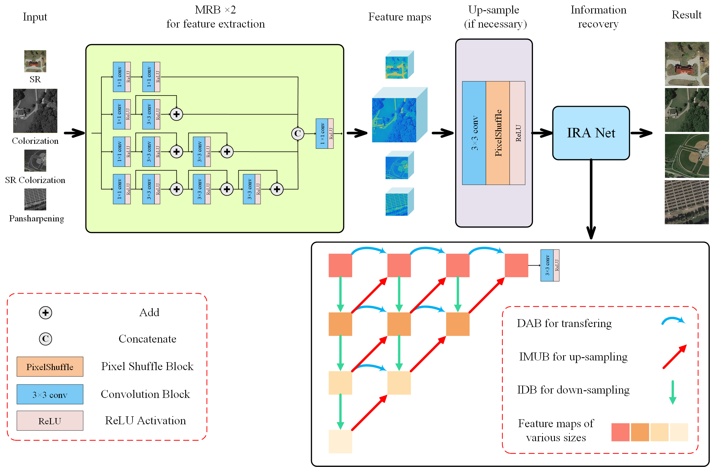 </p>


## Requirements

- Python 3.8
- torch == 1.10.0+cu113
- torchvision == 0.11.0+cu113
- numpy
- skimage
- cv2
- tqdm
- pytorch_msssim


## Prepare Train Datasets

​	**1.1** Download the [NWPU-45](https://hyper.ai/datasets/5449) dataset for training, [AID](https://hyper.ai/datasets/5446) dataset, and [RSSCN7](https://hyper.ai/datasets/5440) dataset for testing.

​	**1.2** Run **`prepare.py`** to prepare the train and test dataset(NWPU-45). Please Update `root_path` and `save_path` .

```python
python prepare.py --root_path XXX --save_path XXX
```
​	**Examples:** 

```python
python prepare.py --root_path /home/eric/PycharmProjects/NWPU-RESISC45/ --save_path ./data/
```


## Train

​	**2.1** Run **`train.py`** to train the model. Please update the `task` , `img_train_path`, `img_test_path`.

```python
python train.py --task XXX --img_train_path XXX --img_test_path XXX
```
​	**Examples:** 

```python
python train.py --task srx2 --img_train_path ./data/train/label/ --img_test_path ./data/test/label/
```


## Test
**Pre-trained Models**: 

|                       URL                       | Extract Code |
| :---------------------------------------------: | :----------: |
| https://pan.baidu.com/s/1MAGgJAvCC-q-Tw1yfsYB5w |     tgrs     |
| https://drive.google.com/file/d/1Q4xLPdE1bpPUtJs7FLYoZFPB2A0_CAAH/view?usp=sharing | - |

Run **`test.py`** to test RSINet on Colorzation, SRX2, SRX4, SRX8, and Colorization SRX2 tasks.:  

​	**For colorization task:**
```python
python test.py --task color --best_pkl_path ./save_model/color.pkl
```

​	**For SR X2 task:**
```python
python test.py --task srx2 --best_pkl_path ./save_model/srx2.pkl
```

​	**For SR X4 task:**
```python
python test.py --task srx4 --best_pkl_path ./save_model/srx4.pkl
```

​	**For SR X8 task:**
```python
python test.py --task srx8 --best_pkl_path ./save_model/srx8.pkl
```

​	**For Colorzation and SR X2 task:**
```python
python test.py --task colorx2 --best_pkl_path ./save_model/colorx2.pkl
```


## Citation

```
@ARTICLE{9721252,
  author={Feng, Jianan and Jiang, Qian and Tseng, Ching-Hsun and Jin, Xin and Liu, Ling and Zhou, Wei and Yao, Shaowen},
  journal={IEEE Transactions on Geoscience and Remote Sensing}, 
  title={A Deep Multitask Convolutional Neural Network for Remote Sensing Image Super-resolution and Colorization}, 
  year={2022},
  volume={},
  number={},
  pages={1-1},
  doi={10.1109/TGRS.2022.3154435}}
```

## SR X4 Examples on NWPU-45 datasets
<p align="center"> 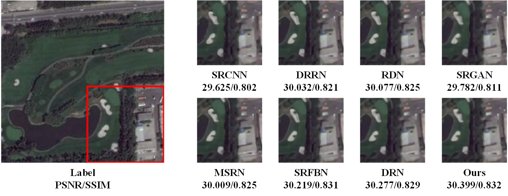 </p>
<p align="center"> 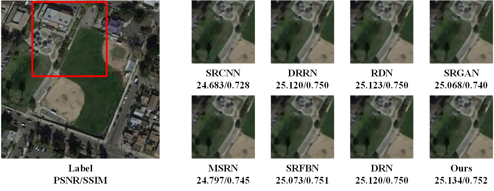 </p>
<p align="center"> 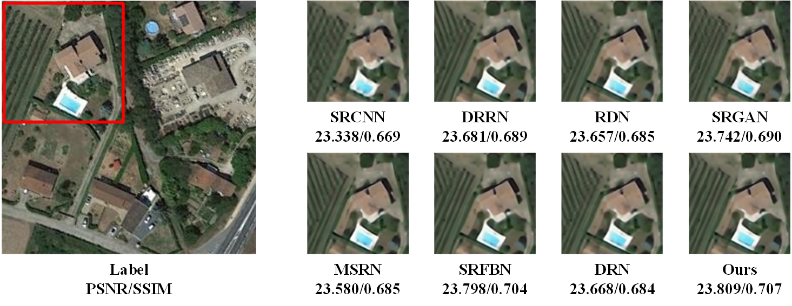 </p>
<p align="center"> 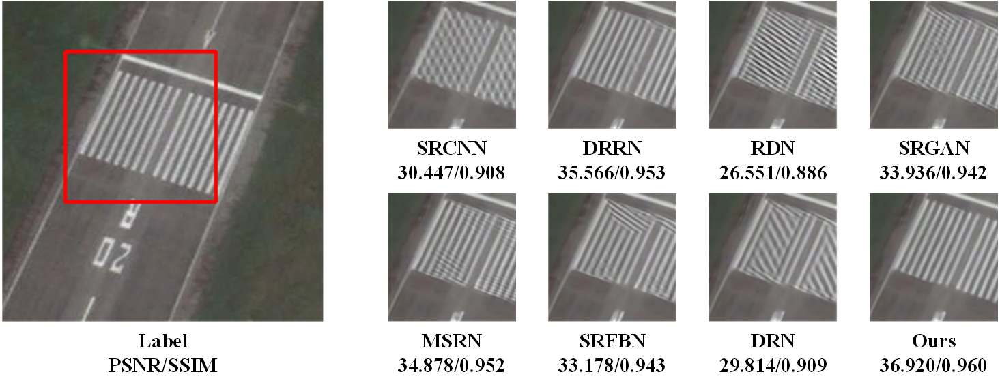 </p>
<p align="center"> 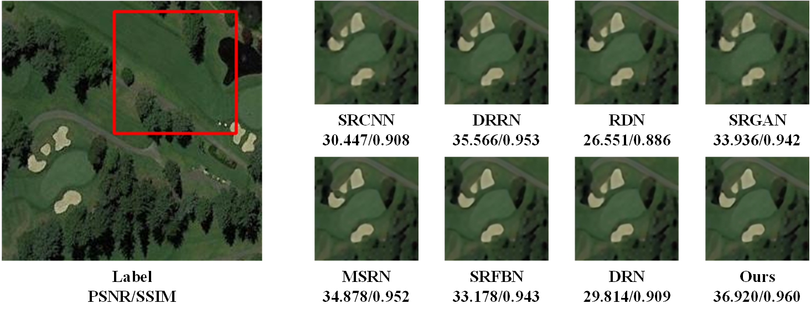 </p>


## SR X8 Examples on NWPU-45 datasets
<p align="center"> 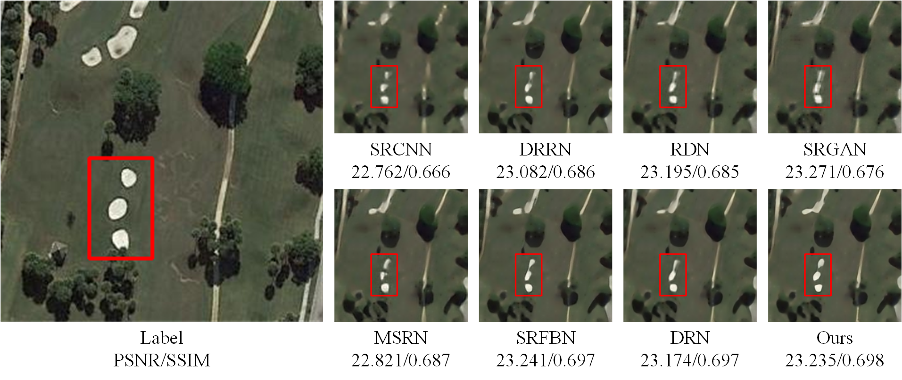 </p>
<p align="center"> 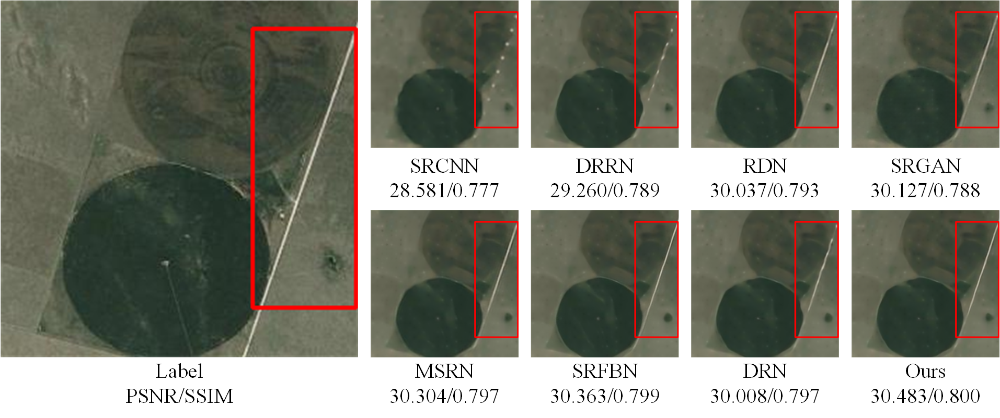 </p>
<p align="center"> 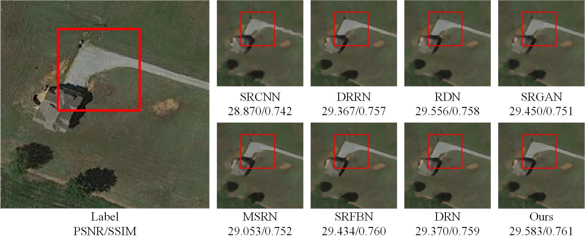 </p>
<p align="center"> 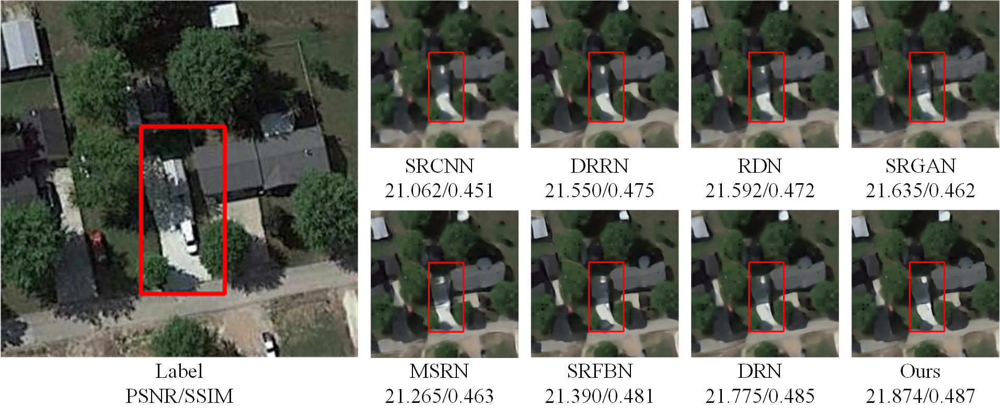 </p>
<p align="center"> 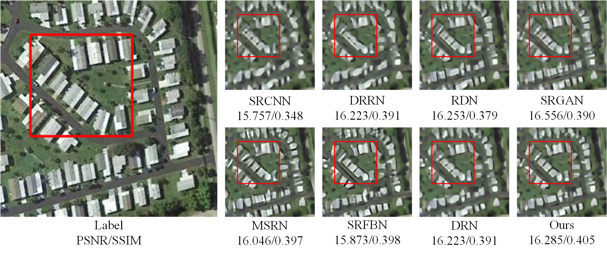 </p>
<p align="center"> 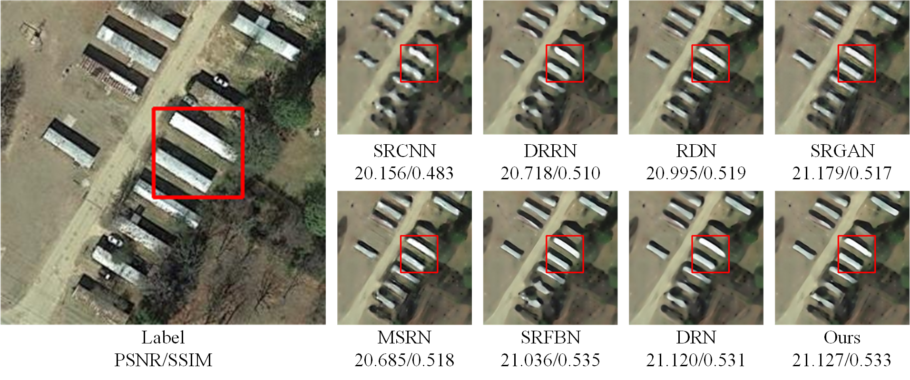 </p>
<p align="center"> 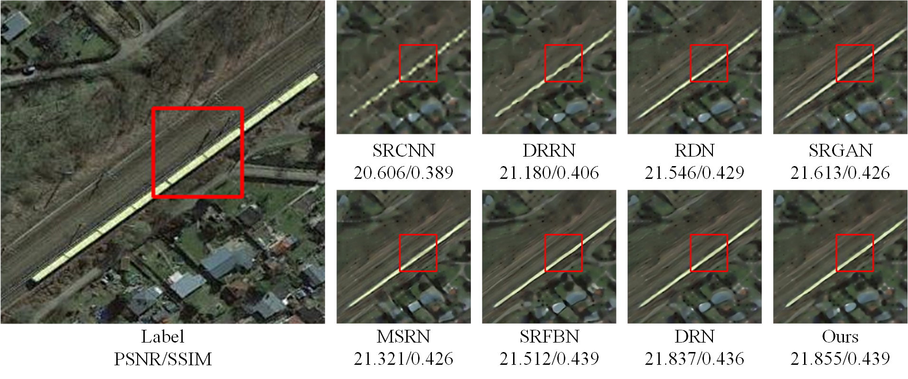 </p>
<p align="center"> 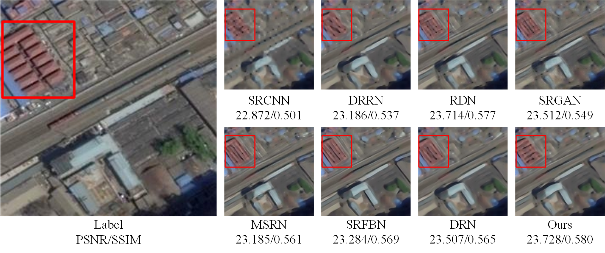 </p>
<p align="center"> 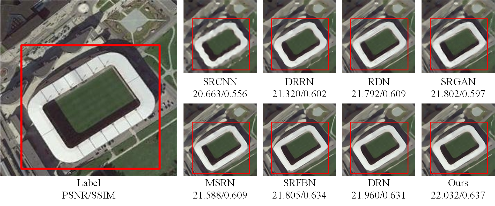 </p>


## SR X8 Examples on RSSCN7 datasets

<p align="center"> 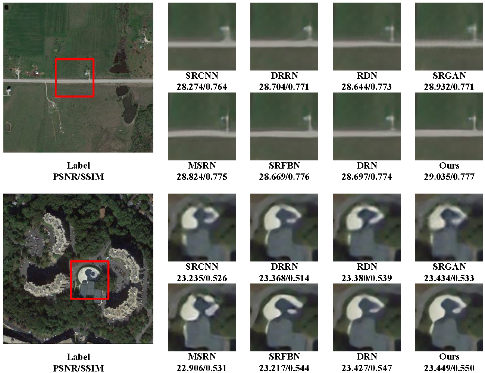 </p>


## SR X8 Examples on AID datasets
<p align="center"> 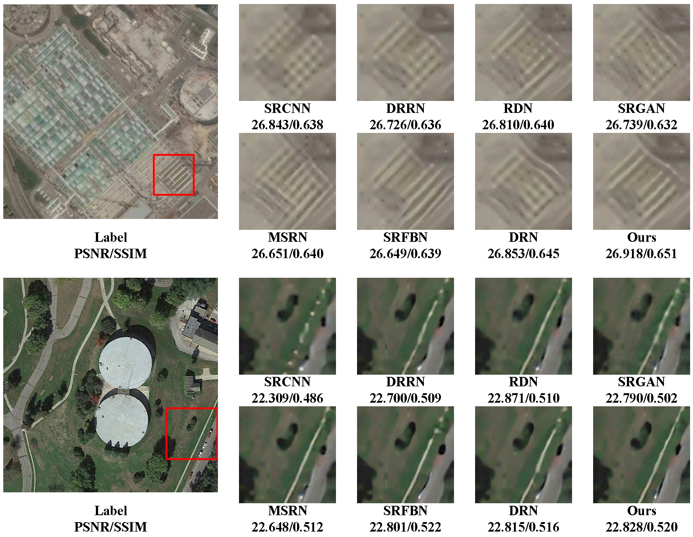 </p>


## Colorization  Examples on NWPU-45 datasets
<p align="center">  </p>


## Colorization SRX2  Examples on NWPU-45 datasets
<p align="center"> 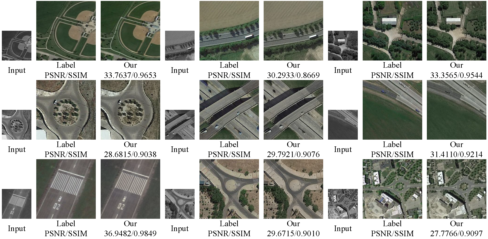 </p>


## Examples of Pansharpening without MS
<p align="center">  </p>


